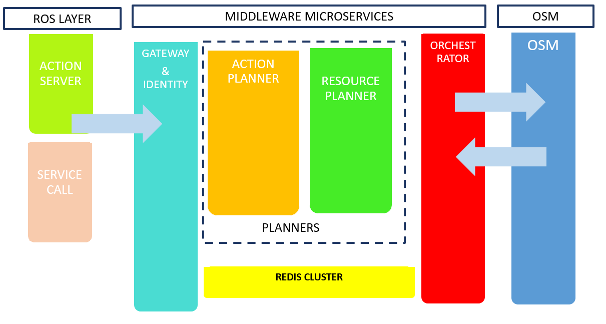

# 5G-ERA Middleware

The repository contains the middleware system applications of the 5G-ERA project.
Visit the 5G ERA project website for more information.
https://5g-era.eu 

*The 5G-ERA project was developed by the following partners under the [consortium](https://5g-era.eu/consortium/) with funding of the European Union's Horizon 2020 Research and Innovation programme under grant agreement No. 101016681.*

For workshops demostrations and tutorials visit our [Youtube Channel](https://www.youtube.com/channel/UCFn5FI9OYLA9_jTwl2cwdFA/videos )

  

## What is 5G-ERA Middleware

5G-ERA Middleware is the Orchestration software responsible for linking vertical applications managed by ROS (Robot Operating System), a 5G infrastructure managed by Open Source MANO (OSM) and the cloud-native network applications ([NetApps](https://github.com/5G-ERA/Reference-NetApp)). It realizes the 5G intent-based networking by utilizing the cloud-native design. The core principles and functionality of the Middleware cover the lifecycle management, recovery and error handling of the applications, and integration of the semantic planning into the orchestration process.

## Design and Architecture

The 5G-ERA Middleware is designed to connect three layers of application networks. First, it combines the ROS network on which the Robot specific application runs with the resource layer network. The Kubernetes network is managed by the OSM and the SDN Controllers that are part of the resource enablement network.
The Middleware mainly operates on the Kubernetes network layer, designed as a cloud-native application. The Middleware is built on the microservices architecture and consists of several components:
*	Gateway – It redirects the traffic across the Middleware system meaning rerouteing to the microservices within the system. It also handles the authentication and authorization process. 
* Action Planner – Integrating the semantic knowledge of the vertical into resource planning. It is part of the vertical level life cycle management implemented by the middleware. 
* Resource Planner – The resource Planner is responsible for assigning the placement example, on the cloud, Edge to the tasks. 
* Orchestrator – It orchestrates the process of the deployment of the resources. It is responsible for the vertical level lifecycle management of the deployed services 
* Redis Interface – Redis Interface allows the users to retrieve, insert and update data from/into the Redis-Server 

The image below presents the conceptual architecture of the 5G-ERA Middleware and the connection between the associated services. The 5G-ERA Middleware has been designed to run in the Cloud and the Edge devices. Therefore, it can be always accessible and provide the best quality of service to the Robot by placement in the closest possible location.
 

  

The 5G-ERA Middleware connects to the Redis Cluster, which allows sharing of semantic knowledge between all the instances of the 5G-ERA Middleware running in every Cloud and Edge device.

## Action Server

The communication between the 5G-ERA Middleware and the robot is conducted using a ROS Action Client, Action Server as well as Service Calls. Both ROS 1 and ROS2 versions are available for the Action-Server/client.

The action client and the robot itself are responsible for letting the middleware know via action server and microservices of the latest status of the action and NetApp. Two types of information are defined here: heartbeat and action status. The first one will be a request from the middleware with a specific frequency to measure the health of the deployed application/s that the currently executed action is using. The second one defines a high-level conceptualization of the status of the action. 

For a more in-detail description of the Action Server see [ACTION_SERVER_README.md](ACTION_SERVER_README.md)

## Middleware API specification

The 5G-ERA Middleware has an OpenAPI specification that can be checked under this [link](https://app.swaggerhub.com/apis/BARTOSZBRTATUS/5-g_era_middleware/0.1).

Try the API with the custom python library [link](https://github.com/5G-ERA/middleware/blob/main/src/Python_Interface_StandAlone/README.md).

## Using the 5G-ERA Middleware

To see how to deploy the 5G-ERA Middleware see the instructions in [ENVIRONMENT.md](ENVIRONMENT.md).

## Developing the 5G-ERA Middleware
To see how to deploy the 5G-ERA Middleware development enviroment, see the instructions in [ENVIRONMENT.md](ENVIRONMENT.md).

## License 
For the licensing information see [LICENSE](LICENSE).
