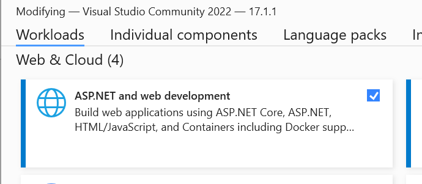
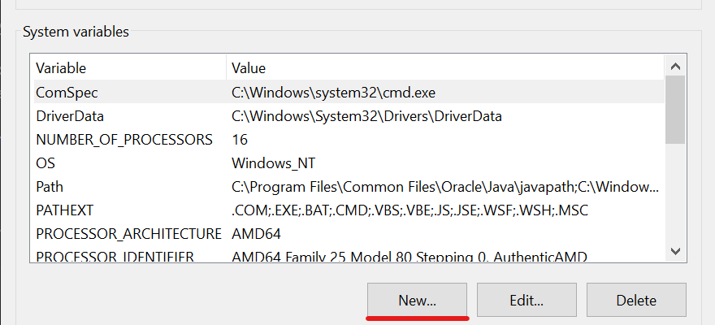
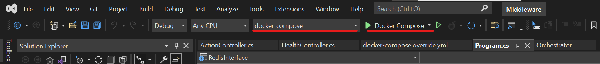
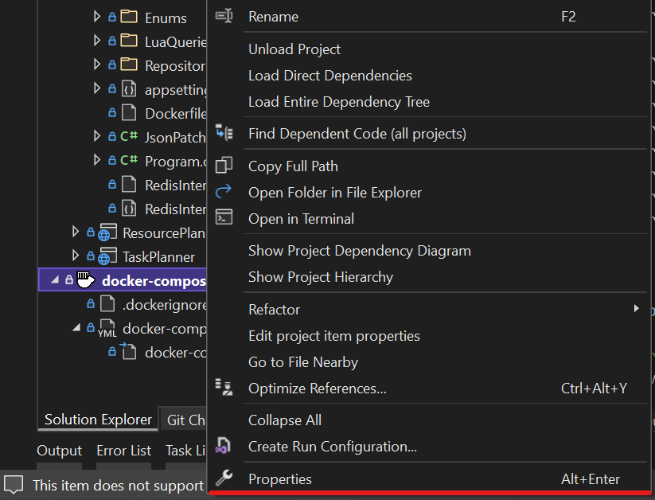
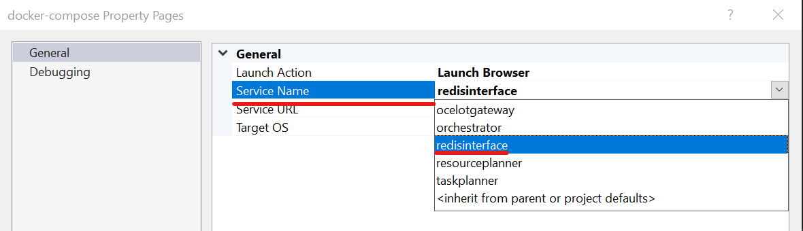
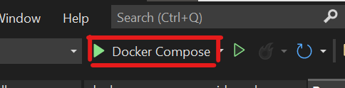
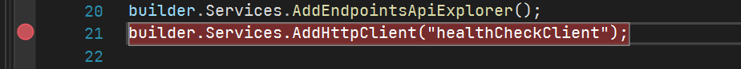
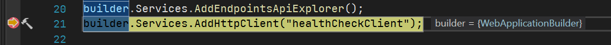
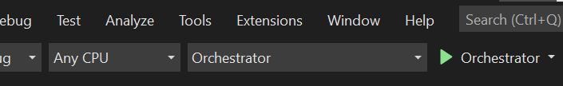
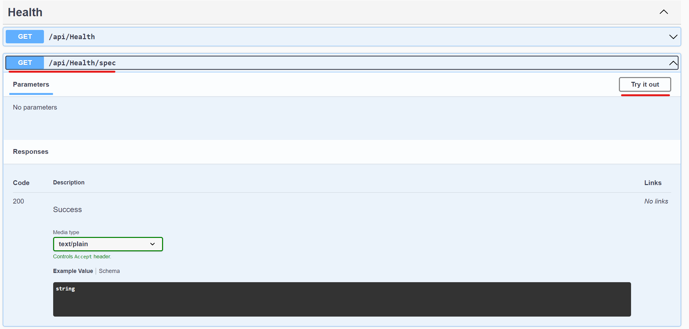

# Middleware

The repository that contains the middleware system applications of the 5G-ERA project.

## Setting up the development environment

The Middleware application is designed to be build around the Visual Studio 2022 installation utilizing the docker-compose support for the testing in the local development environment.

### System configuration

The following components have to be installed to successfully develop and test the applications in the DEV environment.

* **Visual Studio 2022** with the ASP.NET Web development package

* **WSL2** (required for full docker support on Windows) for the instructions on how to install, refer to the official [guide](https://docs.microsoft.com/en-us/windows/wsl/install)
* **Docker Desktop** for running the build containers under docker compose. Follow the official [guide](https://docs.docker.com/desktop/windows/install/) for installation.

Additionally the Environment Variables have to be defined in the Operating system.
To do this go to:

`Menu Start -> View Advanced System Settings -> Environment Variables`

The new Environment Variables are added in using the button at the bottom:


Add 2 new Environment Variables if not defined already:

* **REDIS_HOSTNAME** - Address for the Redis server. It can be address of locally running server or the instance hosted by the 5G-ERA on AWS. The Redis needs to have installed additional modules: RedisGraph and RedisJSON
* **REDIS_PORT** - The port on which the Redis server is operating. The default is `6379`, for the AWS server it has different port
* **AWS_IMAGE_REGISTRY** - the address of the AWS Container Image Registry that hosts the official images for the 5G-ERA middleware

The Middleware has an option to log to centralized Elasticsearch. For this the AWS SecretManager is used. The 2 additional environment variables have to be set to authenticate the machine against AWS.

* **AWS_ACCESS_KEY_ID** - Access Key Id of the IAM user for the AWS account
* **AWS_SECRET_ACCESS_KEY** - Secret Access Key of the IAM user for the AWS account

For the AWS Secret Manager the secrets are supposed to be stored as a plaintext and the names should have the following format: `Middleware-{SettingGroup}__{SettingValue}` for example `Middleware-Database__ConnectionString`.

The SecretManager will automatically map the required `appsetting.json` configuration sections into the correct data.

### Visual Studio Configuration

To properly run the solution from the Visual Studio specify the build configuration as in the image below:


The properties for the Build configuration should be set to `Debug` by default and the architecture for `Any CPU`. It is important to specify the project to run as `docker-compose` as it allows to seamless testing and debugging of the while solution without the need to change any configuration for the system.

Before the start, specify the project that you would like to test. To automatically display the Swagger UI for the desired project, click the Right Mouse Button on the `docker-compose` element in the Visual Studio Solution Explorer and click `Properties`.



In the opened window navigate to the `Service Name` record in the table in the centre and select desired service to be started.


With this property set, all the projects available will be started, but the one that will be opened will be the one selected in this menu.

## Launching the solution

After the environment is properly configured, use the launch button in the top of the Visual Studio under the search box. Click the button or use the `F5` key to launch the solution.



## Debug the solution

Debugging the solution is easy when launching the solution from the Visual Studio. Simply set the breakpoint using the `F9` key or by clicking in the vertical bar on the left of the code.



When the execution reaches the breakpoint, it will be stopped and you will see the code being stopped from there.



When the breakpoint is hit you can navigate with the `F10` key to step forward one line in code or `F11` to step inside the function that is to be executed.

## Handle changes to the API definition

The code contains the internal references to the current definition of the API using the OpenAPI 3.0 specification schema. Based on this specification the code is automatically generated to create the clients for easier access to the API endpoints from the code.

The API schema specification needs to be updated after each change to the endpoints definition. Each change of the return value, status code, adding new endpoints, removing existing or the definition of the models has to be followed with the appropriate procedure described, to make sure that all the APIs are working as expected.

### Update API definition procedure

1. Launch the API in a standalone mode by selecting it as a startup project in the launch bar


2. Navigate to the Health Controller definition in the opened browser window.
3. Execute endpoint `api/health/spec` to download the latest information about the API by pressing `Try it out button`


4. Close browser window
5. Rebuild the whole solution to check for any errors across
6. Commit changes

## Orchestrator

Orchestrator is the entrypoint of the application when started. Its task is to first deploy the rest of the services after its deployment. Orchestrator automatically detects if it is deployed in the Kubernetes cluster and if is it will automatically proceed to the deployment of the services.

It will instantiate the following services in the current cluster:

* Gateway
* Task Planner
* Resource Planner
* Redis Interface

The services are deployed by default in the `middleware` namespace in the kubernetes cluster.
The kubernetes cluster has to be configured with the access to the private AWS registries for the Docker images.

If the AWS cluster is used to deploy the Middleware using the same user that created the registry, the authentication is being done automatically.

If the deployment is not happening on the AWS cluster side the access to the private container registries has to be configured manually using the `docker login` command.
As the prerequisites the following have to be installed on the clients' computer:

* Docker
* AWS SDK

Configure the AWS SDK using the `aws configure` command using your IAM account.

After the access is configured, utilize the following command to authenticate your device replacing the `<region>` and `<aws_account_id>`:

```shell
aws ecr get-login-password --region <region> | docker login --username AWS --password-stdin <aws_account_id>.dkr.ecr.<region>.amazonaws.com
```

When configured the cluster will be able to download the images from the private registry that has been specified.

### Development Environment for Orchestrator

To test the Orchestrator in the development environment some additional configuration has to be made to support the debugging of the application directly in the Kubernetes cluster.

The requirements are following:

* Local K8s cluster - can be Microk8s or Minikube
* `Kubectl` binary on the system
* Bridge to Kubernetes Visual Studio extension. (Available also for the VS Code)

The description of the configuration will use the `Microk8s` installed inside the `WSL2` on Windows operating system.

There are known issues with the `snap` package on the Ubuntu WSL2 due to the systemd dependency. To check if the problem exists use the following command:

```shell
snap info microk8s
```

If the command does not execute after a few seconds the systemd dependency needs to be fixed according to the following [Github thread](https://github.com/microsoft/WSL/issues/5126).

Use the following command to restore the systemd dependency

```shell
sudo apt-get update && sudo apt-get install -yqq daemonize dbus-user-session fontconfig
sudo daemonize /usr/bin/unshare --fork --pid --mount-proc /lib/systemd/systemd --system-unit=basic.target
exec sudo nsenter -t $(pidof systemd) -a su - $LOGNAME

snap version
```

When fixed, install Microk8s with the following command:

```shell
sudo snap install microk8s --classic

sudo usermod -a -G microk8s $USER
sudo chown -f -R $USER ~/.kube
```

It will install microk8s which is the minimal kubernetes installation. Next step is to link the `.docker/config.json` file so it can be used by the Microk8s to authenticate to the private registries. The following command will create the symlink to the `config.json` file to in the microk8s installation path.

```shell
sudo ln -s ~/.docker/config.json   /var/snap/microk8s/common/var/lib/kubelet/  
```

Next step is to configure the `kubectl` binary on the Windows system. Install the `kubectl`, place the binary in the desired location and add the location to the path using the [official guide](https://kubernetes.io/docs/tasks/tools/instal-kubectldeployments/).
kubectl-windows/).

After it is installed we can export the config of the Microk8s cluster to the `kubeconfig` file.

Lets start with creating the `.kube` directory in the Windows home directory. Replace the `<your-windows-user-here>` with the name of your user on the Windows system. The second command creates the symlink between the `.kube` folder on WSL and the folder that we have created in the Windows Home directory.

```shell
mkdir /mnt/c/Users/<your-windows-user-here>/.kube

ln -s $HOME/.kube /mnt/c/Users/<your-windows-user-here>/.kube
```

After this step is done, export the configuration of the microk8s cluster to the `kubeconfig` file.

```shell
microk8s config > ./kube/config
```
When accessed from the Windows filesystem, the contents of the `kubeconfig` file should be visible.

To finish the configuration of the development environment, the `Bridge to Kubernetes` extension has to be installed.   Follow the guide on the [official extension](https://docs.microsoft.com/en-us/visualstudio/bridge/bridge-to-kubernetes-vs) website to complete the configuration of the environment.

#### K8s cluster configuration 

To ensure the correct work of the Orchestrator, the cluster needs to have the specific configuration enabled. Orchestrator is managing the deployment, removal and listing of the kubernetes services, deployments, pods and replica sets. For automating this it needs the required permissions. The permissions required are configured in the [k8s/cluster-config](k8s/cluster-config/) folder of this repository.

The required configuration creates the `ClusterRole` that allows to watch, list, deploy, and delete the resources in the namespaces. By default, the Orchestrator will work only in the `middleware` namespace of the cluster.

Other files are responsible for binding the `ClusterRole` to the namespace and creating the `ServiceAccount` that will allow to access the role from the Orchestrator deployment.

Orchestrator deployment must have the `ServiceAccount` specified in its deployment configuration. 

```yaml
apiVersion: apps/v1
kind: Deployment
metadata:
  name: orchestrator-api
spec:  
    ...
  template:    
    ...
    spec:
      serviceAccountName: orchestrator
      automountServiceAccountToken: true      
      containers:        
      ...
```
#### Launching and debugging the application

To launch the application using `Bridge to Kubernetes`, the service with the backing pod has to be deployed. Example scripts are in the `k8s` folder of this repository and can be deployed using the commands below. The `middleware_deployment.yaml` file has to be filled with the appropriate values for the environment variables specified in the file.

```shell
kubectl apply -f k8s/orchestrator/orchestrator_service.yaml -n middleware
kubectl apply -f k8s/orchestrator/orchestrator_deployment.yaml -n middleware
```
