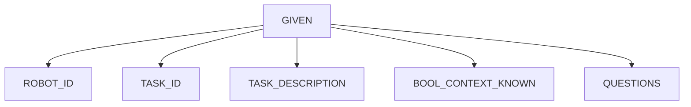

# Planning features in the 5G-ERA Middleware:

The 5G-ERA middleware has a planning module for action and resource planning. This allows a robot to ask for a high level task and allow the middleware to provide low level action sequence with required algorithms as containers resembling KNF and VNF. Planning is divided in two main categories depending if the context surrounding the robot is known or not.

## 1) Known Context Planning:

This means that the predefined action sequence stored in redis knowledge graph is adapted specifically for the Task with known context (location, enviroment, robot). This is the classical approach in planning and works like an expert system that restrains uncertainty to be minimal and oriented to failure in the robot algorithms, OS or HW, however, the context outside the robot will not change or is expected not to change. This planning is triggeered when the parameter **BOOL_CONTEXT_KNOWN** is set to true, allowing the middleware to know that unknown situations will not happend as far as the surrounding enviroment is concerned. This is specially true for static robots robots that work in factories and brazing cells. The client strongly believes the outside factors will not change and provides a deterministic action sequence for the redis knowledge graph.

Calling the API planning endpoint will require providing the following data:
#### GET /PLAN/{param}
```json
{
  "RobotId" : "Guid",
  "LockResourceReUse": "bool",
  "TaskId" : "task_id",
  "TaskDescription": "string",
  "ContextKnown" : "bool",
  "Questions": [
    {
    "Id": "guid",
    "Question": "Do you have a map?",
    "Answer": "True/false"
    }
  ]
}
```

### 1.1) Planning endpoint



### 1.2) Replanning endpoint

## 2) Unknown Context Planning:

lorem ipsum
