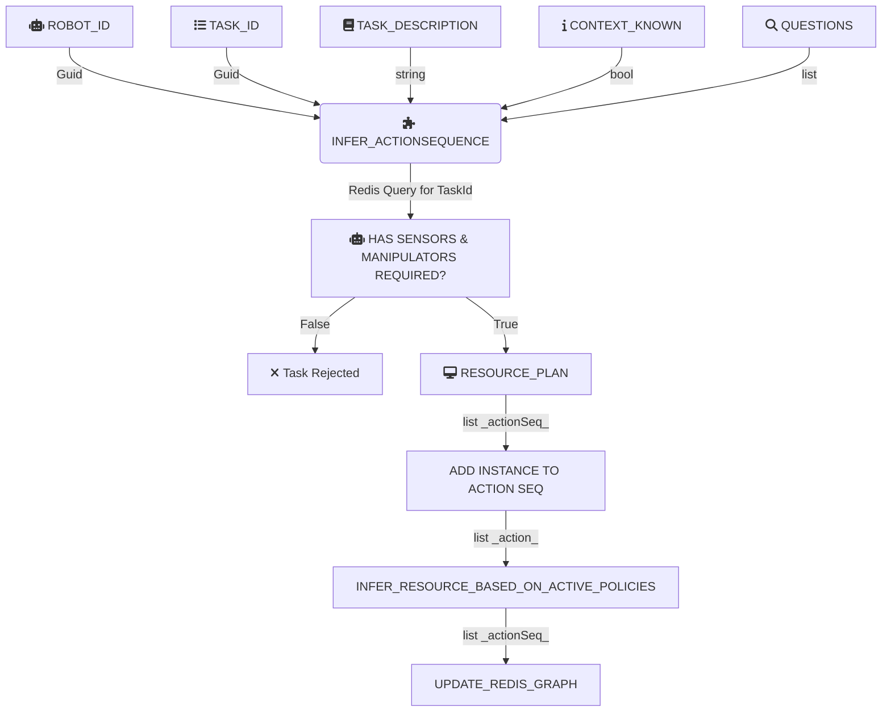

```mermaid
graph TD
    A[fa:fa-robot ROBOT_ID] -->|Guid| B(fa:fa-puzzle-piece INFER_ACTIONSEQUENCE)
    H[fa:fa-list TASK_ID] -->|Guid| B(fa:fa-puzzle-piece INFER_ACTIONSEQUENCE)
    HH[fa:fa-book TASK_DESCRIPTION] -->|string| B(fa:fa-puzzle-piece INFER_ACTIONSEQUENCE)
    HHH[fa:fa-info CONTEXT_KNOWN] -->|bool| B(fa:fa-puzzle-piece INFER_ACTIONSEQUENCE)
    HHHH[fa:fa-search QUESTIONS] -->|list| B(fa:fa-puzzle-piece INFER_ACTIONSEQUENCE)
    B --> |Redis Query for TaskId|C[fa:fa-robot HAS SENSORS & MANIPULATORS REQUIRED?]
    C -->|False| D[fa:fa-times Task Rejected]
    C -->|True| E[fa:fa-desktop RESOURCE_PLAN]
E[fa:fa-desktop RESOURCE_PLAN]-->|list _actionSeq_|Q[ADD INSTANCE TO ACTION SEQ]
Q[ADD INSTANCE TO ACTION SEQ]-->|list _action_|P[INFER_RESOURCE_BASED_ON_ACTIVE_POLICIES]
P[INFER_RESOURCE_BASED_ON_ACTIVE_POLICIES]-->|list _actionSeq_|K[UPDATE_REDIS_GRAPH]


```
