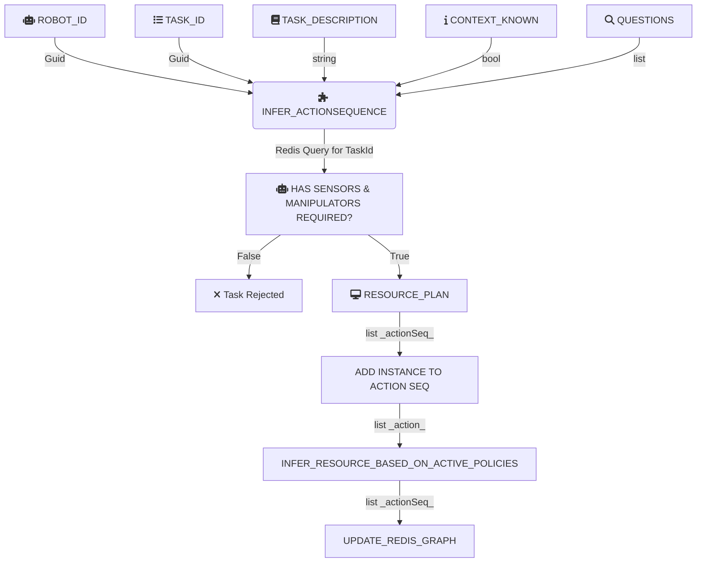

# Planning features in the 5G-ERA Middleware:

The 5G-ERA middleware has a planning module for action and resource planning. This allows a robot to ask for a high level task and allow the middleware to provide low level action sequence with required algorithms as containers resembling KNF and VNF. Planning is divided in two main categories depending if the context surrounding the robot is known or not.

## 1) Known Context Planning:

This means that the predefined action sequence stored in redis knowledge graph is adapted specifically for the Task with known context (location, enviroment, robot). This is the classical approach in planning and works like an expert system that restrains uncertainty to be minimal and oriented to failure in the robot algorithms, OS or HW, however, the context outside the robot will not change or is expected not to change. This planning is triggeered when the parameter **BOOL_CONTEXT_KNOWN** is set to true, allowing the middleware to know that unknown situations will not happend as far as the surrounding enviroment is concerned. This is specially true for static robots robots that work in factories and brazing cells. The client strongly believes the outside factors will not change and provides a deterministic action sequence for the redis knowledge graph.

Calling the API planning endpoint for a known context plan will require providing the following data:

#### GET /PLAN/{param}
```json
{
  "RobotId" : "Guid",
  "LockResourceReUse": "false",
  "TaskId" : "task_id",
  "TaskDescription": "string",
  "ContextKnown" : "true",
  "Questions": []
}
```

* The RobotId is a unique identifier generated after the [registration](https://github.com/5G-ERA/middleware/blob/main/docs/1_Middleware/3_Architecture/Gateway/ProposedInterface.md)
* LockResourceReUse parameter avoids the middleware from trying to reuse some of the containers from other past deployments with same instances. Recommed to be false by default.
* TaskId parameter is automatically generated when performed a new [onboarding_task](https://github.com/5G-ERA/middleware/blob/main/docs/1_Middleware/3_Architecture/RedisInterface/ProposedInterface.md). Let's recall that it will contain a predefined action sequence with the **Known Context** perspective.
* Questions: list of questions template including task criticality, priority, danger etc. This will mainly be applied to the resource planner to choose a much power powerful machine to avoid failure.

For more information about this API endpoint, check [API](https://github.com/5G-ERA/middleware/)

### 1.1) Planning endpoint
The parameters from the API call are fetch into the system and the actionPlanner Module starts. 

-The taskId is checked to be registered in the redis graph. (If not present, the task will be rejected as **ContextKnown** is set to true.)

-A new plan Id is automatically generated for this request along side a task object.

-For each action in the action sequence retreived from redis, the middleware will check the robot has the sensors and actuators neccesary for the vertical netApps(instance algorithms).

-The actions will be added to new task object as part of the action sequence.




### 1.2) Replanning endpoint

## 2) Unknown Context Planning:

lorem ipsum

