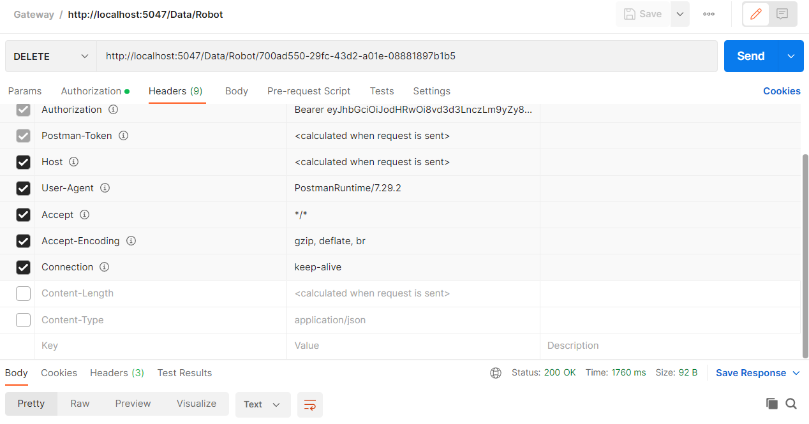

## Offboarding of a robot from the middleware:

If we want to remove a robot from the middleware, all we need to know is the **Id** of this one. Use the endpoint provided and change localhost for the IP of the middleware.

´´´
http://localhost:5047/Data/Robot/
´´´

  

