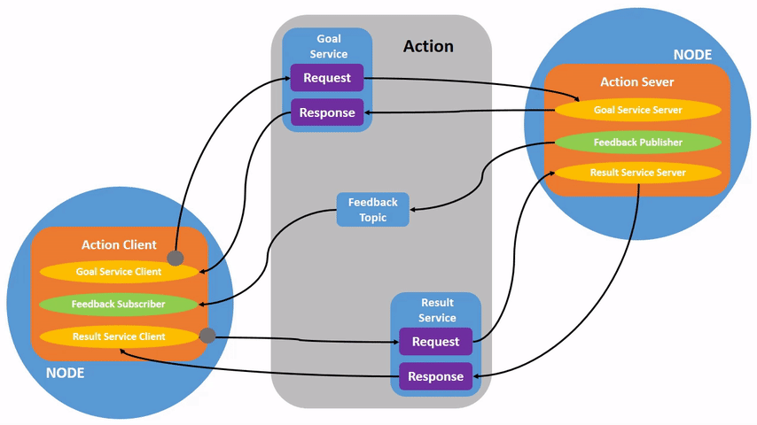

# Middleware ActionServer
The action server is responsible for the communication between the robot and the 5G-ERA Middleware. It is the interface between ROS and robot-related applications and middleware tasks and resource orchestration.

## INTERFACE WORKFLOW:
1) A ROS action client (running in the robot) sends an action goal using the ROS action message. This goal has 2 properties: taskId, and action reference.
2) A ROS action server (running in the robot) will listen to this goal request. It will first check if the `actionReference` is 0, meaning that this goal is not a subgoal of an action sequence that is already running.
 
    2.1) If actionReference is 0, the action server will not need to delete any cloud-native resources that may have been created for the task sequence as this is a new task that will start with step 1. Taking this into account, the action server will try to log in to the middleware and request a plan. If this is successful, the action goal will change state to accept. The action server will follow by sending the action sequence plan created by the middleware to the action client so the robots know which steps should be taken to accomplish this task. 

   2.2) The action client will now send a new action goal with the same `taskId` and the first actionId from the action sequence. This means that the robot wants to start doing the first action within the action sequence.
  
   2.3) The action server receives this new goal and sees that the action reference field is not empty. It will try removing any previous resources allocated to this action sequence if this applies. Since this is the first step, the server side will not tell the middleware to delete any resources as there is none. After this, the server will report back to the client with a frequency of 1 minute, the state of the allocated resource to achieve this action from the action sequence. This will loop until the action client sends a new goal meaning it wants to jump to the next step.

   2.4) The same process will apply until the last action is reached and successfully finished by a robot. In this case, a final action goal will be sent with the `taskid` and the `actionReference` been 1. This 1 will tell the action server the last action was completed, you may remove the resources and call the goal a success. Configure the action result to be set to successful also.
   
 3) The middleware will log out of the middleware system. 


## Coding Environment set-up (windows base systems):
1) Start by downloading git, if you don't have it --> https://git-scm.com/downloads
2) Install Jetbrains Pycharm --> https://www.jetbrains.com/es-es/pycharm/
3) In the top bar menu, select VCS and choose git. This will prepare the git application for Pycharm.
4) In the top bar menu, select git --> clone --> copy the ssh clone from this repo
5) You may need credentials as this is a private repo. Please [generate a new ssh key](https://docs.github.com/es/authentication/connecting-to-github-with-ssh/checking-for-existing-ssh-keys) (Remember to run the command: `start-ssh-agent.cmd` once the key is generated and copy this one "id_rsa.pub" to the settings, ssh keys in your git profile.)
6) With this, you will have a fully synchronized version of the git repo in Pycharm. Please note that ROS commands will not be recognized by Pycharm, only native Python.


## Run the Action Client and Server:
First, download the zip file from this repo and, if using Windows, launch WSL Ubuntu and copy the file using this command:

```
cp -r /mnt/d/User/Desktop/middleware-actionserver-main /home/adrian/robotics/ros2
```
In WSL Ubuntu cd to the directory where the Dockerfile is located under the SRC downloaded solution

Run the command to build the image:
```
docker build -t actionImage:lastest .
```
Run the command to create a container of the image type

```
docker run -d -it actionimage:lastest
```

Connect to the docker container
```
docker exec -it 2288d1f92dea /bin/bash
```
Enroll the container in the middleware network (from outside the container)
```
docker network connect middleware_network 2288d1f92dea
```

If you get the following error, please make sure the middleware application is running beforehand as it will create the docker network that this docker-compose will engage with.


Navigate to path --> home/dev_src/ and source the workspace.

```
source install/setup.bash
```
Follow by running in 2 different terminals connected to the container, the action Client and the action Server.

```
ros2 run ActionServer5G ActionServerNode
```


```
ros2 run ActionClient5G ActionClientNode
```


Additionally, if you want to run the action client as a simple ros2 command, you can use:

```
ros2 action send_goal --feedback fibonacci action_tutorials_interfaces/action/Fibonacci "{goal_taskid: "4225e56e-4b68-4372-9d34-66bba1a633b3",action_reference: 0}"
```
# middleware-actionserver
## Action-Interface 

The tasks and actions derived are all managed by an action interface that handles communication between the robot side (ROS action client & Server) and the cloud-native Middleware. Each action within the action sequence has an associated ROS action goal. This action stores a state machine in which the status of the action performed by the robot is captured and always known. The communication between the robot and the Middleware is performed using REST API calls. These are defined in a ROS Action Server always running inside the robot. The action server listens to potential action goals issued by the Action Client. The 5G Era architecture defines a protocol of one Action Server and client per robot.
The action interface is responsible for letting the Middleware know the status of the actions. The interaction between action server and gateway links the latest status of the action and corresponding NetApps together. Two types of information are defined here: heartbeat and action status. The first one will be a request from the Middleware with a specific frequency to measure the health of the deployed application/s that the currently executed action is using. The second one defines a high-level conceptualization of the status of the action. 
The ROS action goal is a specific protocol defined in the ROS action interface for managing the Lifecycle of the actions. The specific custom ROS action goal defines a parent task and other attributes necessary to keep a complete update as shown in the table below. 
The action interface is illustrated in the figure below with the action client on the left and the action server on the right. The two sides are linked by the action goals and the feedback.

<p align="center">
  
</p>

The action interface realizes the state machine which reflects the lifecycle of the ROS actions. The state machine is illustrated in the figure below. This is explained in the workflow in the following paragraph. 

<p align="center">
   
   </p>
   

* The robot wants to perform a high-level task. It will begin to communicate with the ROS action client using standard ROS message types (Topics).
* The action client is triggered and will issue an action goal message to the ROS network. This action will have the parameters defined in the table above. 
* The action-server will listen to this action goal and trigger the protocols to check if this goal can be accepted by the system. This includes verifying the connectivity to the Middleware, successfully logging in and waiting for a successful plan provided by the Middleware. If any of this fails, the action-server understands that the Middleware will not be able to help the robot and therefore the goal will be changed to state aborted. (Remember that ROS maintains a state machine for every action goal)
* If the Middleware answers back with a plan using microservice transactions, the action goal will be changed to state accepted and this updated state will be known by the action client which will then inform the robot that the cloud resources are available to use.
* For a high-level semantic task, the Middleware will break down the task into smaller, simple parts known as actions. The output of the Action planner model will be an action sequence. This list of individual actions will have allocated cloud resources as containers and handled by the Middleware Orchestrator and planned by the Resource planner. This action sequence will be part of the response provided to the action server for the robot to know how many steps must be performed and for the robot to update the system for which the robot is currently at any time. This is important as the Middleware will have to remove the resources given after they have been used or plan for another robot to use them instead of recreating the same ones. Some containers and resources have the property of being reusable. 
* Usually, ROS implementations of the action server will provide the information of when the server-side has finished execution to the action client. This logic is inverted in this implementation. In this case, the client side is responsible for letting the server side when the resources are no longer needed and can be discarded. This protocol is achieved by issuing a new action goal with the same task ID and different parameters about which step the robot is in and the status. If the robot is executing step one and the server side receives a new action goal with the same task ID and step 2 in an action sequence. Then the server knows the robot wants to move to the following step and the currently allocated resources may be removed if deemed necessary. 
* For an element of the action sequence, the server side is responsible for updating with a predefined frequency status of the resources allocated. This is part of the feedback parameters of the action goal defined by ROS.
* After the robot has finished the execution of the last element in the action sequence, a new goal will be issued to let Middleware know that the task has been completed. The new goal will have a specific value to let the Middleware know that the overall high-level task was achieved successfully. This property is the action reference with value –1. When receiving this goal, the status of this goal will be changed to success in the state machine and the result call-back will be called. 


