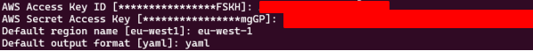

# Middleware installation guide:

Last time revised: 09/03/2023

## 1) Docker Engine installation: 
The first step is to install Docker Engine. Docker engine is used for the verification of the credentials
and pulling the containers from the private AWS registry that Middleware uses.
To install the Docker Engine, refer to [Docker's official website](https://docs.docker.com/engine/install/ubuntu/) on how to install it on the Ubuntu distro.
For easier access to the Docker CLI execute the [post-installation steps](https://docs.docker.com/engine/install/linux-postinstall/).

## 2) AWS CLI installation

After the installation of the Docker, the AWS CLI must be installed. It is used to authenticate the computer and the Docker client for access to the private container registries.

To install the AWS CLI, follow the [official guide](https://docs.aws.amazon.com/cli/latest/userguide/getting-started-install.html) on the installation process.
After finishing, the installation process of AWS CLI it is time to configure the AWS CLI with the IAM
account that has access to the services needed to run the Middleware.

Use the following command to configure the AWS CLI:

```console
aws configure
```

During the execution of the command supply the AWS Access Key ID and AWS Secret Access Key and
the default region to be used. The required container registry is in the eu-west-1 region. You can also
specify the default output format for the CLI. The example is shown in the Figure below.

<p align="left">
    
</p>

## 3) Authenticate docker with AWS credentials

After the Docker and the AWS CLI are installed, use the following command to authenticate your device against the AWS cloud

```console
docker login -u AWS -p $(aws ecr get-login-password --region eu-west-1) 394603622351.dkr.ecr.eu-west-1.amazonaws.com
```

After executing this command, you should be able to pull the images from the private AWS registry. It
can be verified using the following command:

```console
sudo docker pull 394603622351.dkr.ecr.eu-west-1.amazonaws.com/5g-era-redis
```

This will download the 5g-era-redis image that hosts the Redis cache.

**Note!**
The token obtained using the aws ecr get-login-password will expire after a few hours and re-running
the command will be necessary, as Microk8s does not provide support for the credential-helpers. In
case when errors occur during the logging into the ecr, the deletion of the .docker/config.json file
usually helps.


## 4) Install kubectl
The kubectl is the command-line tool that allows communication and management of the Kubernetes
cluster. To install it use the preferred way on the [official guide](https://kubernetes.io/docs/tasks/tools/install-kubectl-linux/). 

Afterwards, if .kube file was not created:

```console
mkdir -p ~/.kube
```

## 5) Install Microk8s

Microk8s is the minimal Kubernetes installation that can be used on the local computer. It will be used
to run the Middleware. Install it with the command:

```console
sudo snap install microk8s --classic
```

```console
sudo usermod -a -G microk8s $USER
```

```console
sudo chown -f -R $USER ~/.kube
```

After the installation is finished copy the configuration file of the Microk8s to the .kube/config file so
the kubectl command can communicate with the newly installed cluster.

```console
sudo microk8s config > ~/.kube/config
```

Afterwards, validate the connection to the cluster with the command

```console
kubectl get all -n kube-system
```

Afterwards, the additional modules for the microk8s must be installed:

```console
 sudo microk8s enable metallb
```


```console
 sudo microk8s enable dns
```

```console
 sudo microk8s enable ingress
```

```console
 sudo microk8s enable community
```

```console
 sudo microk8s enable multus
```

It enables the DNS on the cluster as well as the Load Balancer and Multus network card. During the
installation, the program will ask for the range of the IP addresses for the Load Balancer. Provide
desired range, it can be a default one.

## 6) Configure Microk8s access to Docker credentials

After the successful installation of the Microk8s, it must be configured for access to the private AWS
Registry. For this, the Microk8s must be stopped. 

```console
microk8s stop
```

In the next step create the link to the Docker credentials for the Microk8s:

```console
sudo ln -s ~/.docker/config.json \
 /var/snap/microk8s/common/var/lib/kubelet/
```

Next, start the Microk8s

```console
microk8s start
```

Afterwards, Microk8s is operational and can clone the images from the private repositories.

## 7) Microk8s cluster configuration

After the Microk8s is installed and the kubectl command has access to the cluster, it is time to
configure the cluster so the middleware can be deployed and function correctly inside of it.

For this purpose, the Service Account with the correct permissions is needed. The Service Account will
give the necessary permissions for the Middleware access to the Kubernetes API and to manage the
resources as a part of its functionality.

### 7.1) Middleware namespace

As the whole middleware operates in the middleware k8s namespace, it is required to create it before
the launch of the service. To do so, use the command:

**Note: Make sure you are in the same directory as the downloaded files.**

```console
kubectl create namespace middleware
```

The files required for the execution of the cluster configuration are provided [here](https://github.com/5G-ERA/middleware/tree/main/k8s/cluster-config): 

```console
kubectl apply -f orchestrator_service_account.yaml 
```

The next step is to create the Cluster Role, which specifies the permissions needed for the proper
functioning of the Middleware. Cluster Role specifies the permissions to get, watch, list create and
delete resources in the Middleware namespace. It affects the pods, services, deployments,
namespaces, and replica sets in the cluster. To apply for the Cluster Role, use the following command:

```console
kubectl apply -f orchestrator_role.yaml 
```

The last step to configuring the Kubernetes cluster is to bind the Cluster Role to the Service Account.
For this the Cluster Role Binding is necessary. To create it, use the following command:

```console
kubectl apply -f orchestrator_role_binding.yaml
```

## 8) Middleware Deployment Instruction

The last step is to prepare the deployment script for the middleware. It can be found [here](https://github.com/5G-ERA/middleware/blob/main/k8s/orchestrator/orchestrator.yaml) and needs to be downloaded. In the
orchestrator_deployment.yaml file there are environment variables that must be set for the correct
work of the Orchestrator. The needed variables are:

1. AWS_IMAGE_REGISTRY – contains the address of the registry in which the Middleware
images are stored
2. REDIS_INTERFACE_API_SERVICE_HOST – hostname of the REDIS server that has the Middleware data
3. REDIS_INTERFACE_API_SERVICE_PORT – port on which REDIS operates
4. Middleware__Organization – the organization to which this middleware belongs.
5. Middleware__InstanceName – a **unique** name of the middleware.
6. Middleware__InstanceType – Either Edge/Cloud


The current running version is: 0.2.3 in the image of container.

After all the values are set, the Middleware can be deployed. Start with the deployment of the
whole Orchestrator:

```console
kubectl apply –f orchestrator.yaml –n middleware
```

The containers will be downloaded, and the Orchestrator will deploy the rest of the Middleware
deployments and services required to function correctly. 

## 9) Verification of Middleware Deployment

To check and monitor the status of the deployment of the Middleware services use the following
command:

```console
watch -c kubectl get all -n middleware
```

It will monitor the status of all the services deployed in the middleware namespace.

The following
objects should be deployed:

1. Orchestrator
2. Redis interface
3. Gateway
4. Task planner
5. Resource planner

Each of these services is represented by the pod, service, deployment and replica set in the Kubernetes
environment. With the deployment of the Orchestrator, the other services are deployed
automatically. The process of their deployment may take a while depending on the internet
connection that machine has. If only the Orchestrator is visible with the status of the pod as Container
Creating, it needs additional time to download the application. After the deployment of the
Orchestrator, soon the other components should begin their deployment. The result should look like
the image below - Deployed middleware.

<p align="left">
    
</p>

If there are errors during the deployment of the orchestrator, then check if you correctly configured
access to the AWS registry.
In case there are any errors during the deployment of the Gateway and Redis interface, check if the
firewall does not block access to the Redis server.
After the deployment is complete the gateway should be accessible through the IP address specified
in the EXTERNAL-PI column. In case the IP address is not working use the following command to
redirect the traffic from the specified port on the localhost to the gateway:

```console
kubectl port-forward -n middleware service/gateway 5000:80
```

This command will port forward the traffic from port 5000 to port 80 in the service. The middleware
will be now accessible under the following address:

```console
http://localhost:5000/
```

## 10) Common errors:

### 10.1) If after running the middleware for a couple of hours you find this error, it is because the keys need to be refresed.

<p align="left">
    
</p>

Go to the following [directory](https://github.com/5G-ERA/middleware/blob/main/k8s/orchestrator) and launch these scripts in order:

```console
./delete_all.sh 
```


```console
./credentials.sh 
```

```console
./deploy.sh 
```


### 10.2) Error installing microk8s:  

<p align="left">
    
</p>

If the command 
```console
sudo snap install microk8s --classic
```

Then update snapd by:

```console
sudo apt update
```

```console
sudo apt upgrade snapd
```


