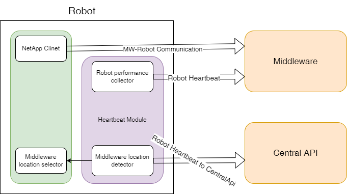

# Robot Heartbeat integration

## Middleware heartbeat

When a robot performs a task and utilizes the Middleware, it needs to provide the Middleware with periodic status information about the following properties:

* Id of the robot
* BatteryLevel
* CPU utilization
* RAM utilization
* GUID of the ActionPlan
* Index of the currently executed action in the ActionSequence
* Quality Map status

Heartbeat should be running in the background to the NetApp Client receiving information from the Middleware. 
`RobotPerformanceCollector` will be running in the background and the intervals described by the Middleware, will collect information about the Robot's hardware utilization and send it to the Middleware.

## Central Api Heartbeat

Additionally, robot will have a second heartbeat to CentralApi which will report the connection to the available Middlewares. It will send:

* Robot Id,
* Organization,
* list of available Middlewares OR dictionary with Latency to each Middleware

`MiddlewareLocationDetector` will be responsible for calling default Middleware addresses to make sure that the location is available. 

## Selection of the Middleware location based on the latency when starting the client (optional)

When the NetApp client is first initialized it will connect to the CentralApi to recieve the list of available Middlewares. NetApp Client will probe all the available Middleware locations and determine the best one, based on the latency.
Later it will initialize connection with the selected Middleware and begin working as usual.