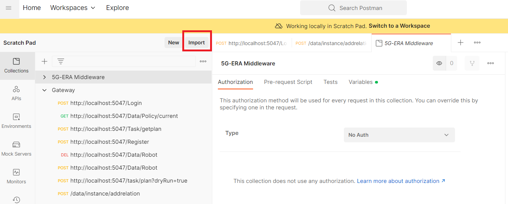
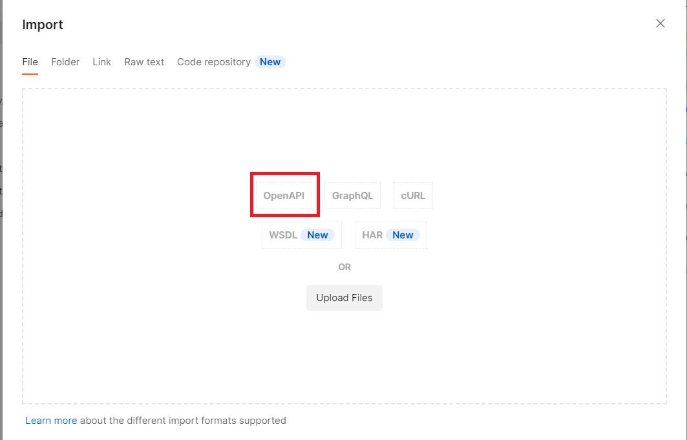

## IMPORTING THE OPENAPI SPECIFICATIONS TO POSTMAN:

To perform the QA testing for the middleware, you may use postman and import 5G-ERA API according to this tutorial. First, click on the import buttom in the application.

<p align="left">
  
</p>

Following, select "openAPI". Finally, find the file **OpenAPISpec.json** in the root folder of the 5g-ERA. 

<p align="left">
  
</p>

If you have not downloaded the 5G-ERA package, you may do so from the github official page or by running the command:

```
git clone https://github.com/5G-ERA/middleware
```

If you have the middleware installed in your system for development under visual studio, you may change **{{baseUrl}}** in the endpoints to **http://localhost:5047**. If not, please use the IP from the 5G-ERA gateway.