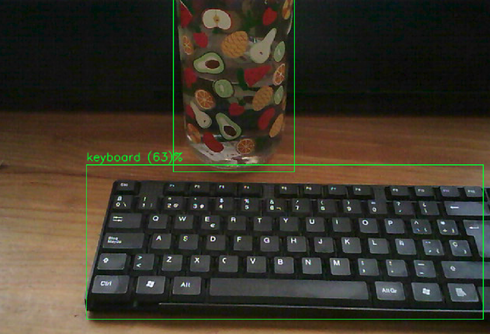

# 1) Consuming Objected detection - Reference NetApp in machine with Middleware and ROS Melodic installed using USB CAM

In this turotial, we will launch an object recognition net application using 5G-ERA Middleware and consume it by using as input a ROS topic with a USB Camera.
In this way, by using RVIZ or image_view package, the bounding boxes of predictions can be depicted.

1. Install Middleware in Ubuntu 18.04.6 LTS

The following [guide](https://github.com/5G-ERA/middleware/blob/main/docs/Administrator/Middleware_Installation.md) show case the procedure.

2. Run python script to launch reference netApp.

Navigate to the script location under middleware-main/src/

```console
python3 MiddlewareInterfacePythonSnippet.py 
```

After this, a new pod will be created with the netApp. Use this command to check the state of the middleware namespace.

```console
watch -c kubectl get all -n middleware
```

3. Launch USB CAM ROS package

Plug your usb camera or usb inbuilt camera of your pc. If the ROS USB_CAM is not installed in your system, use this command:

```console
sudo apt-get install ros-melodic-usb-cam
```
**NOTE:** Change the ROS distro if you are using another ROS.

Launch the ROS package and verify it is working.

```console
rosrun usb_cam usb_cam_node 
```

You can verify it is working by running this command with the USB camera topic.
```console
rosrun image_view image_view image:=/usb_cam/image_raw
```

4. Launch NetApp ROS Client

Check the external IP address of the pod with the netApp. This will be the input parameter to "NETAPP_ADDRESS". The port will stay the same: "5896".
Finally, include the camera topic in "INPUT_TOPIC". The command should look like:

```console
sudo docker run --rm --net host --env NETAPP_ADDRESS=10.64.140.44 --env NETAPP_PORT=5896 --env INPUT_TOPIC=/usb_cam/image_raw --env OUTPUT_TOPIC=/results but5gera/noetic_client:1.0.0
```

5. Retreive the preditions: 
Lets run image_view package with the output topic of the ROS netApp Client.

```console
rosrun image_view image_view image:=/results
```

<p align="left">
    
</p>
