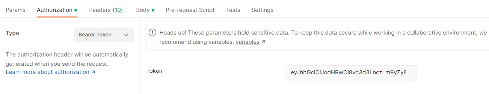

# Onboarding a new Cloud to the middleware system:

For the middleware to plan network applications placement, it is important to load the network topology inside the system. In this section, we will learn how to create a new Cloud entity in the Redis backend of the middleware.

A cloud template looks like this. All the fields must be completed. You may use automatically generated GUID for the id field. 

## Step 1 :  
User needs to be registered with the Middleware system. After Registeration, a token will be generated which will be used to create Robot, Onboarding Edge/Cloud, shown below; 


## Step 2 : Cloud Template

a. Run Guid Generator https://www.uuidgenerator.net/guid for the new Guid ID.

b. Complete all the fields including, 
Type should be always Cloud for onboarding cloud, 

Cloud status should be (Unknown, Active, Idle, Off)

Cloud Ip; if you running your system on windows 
                     ifconfig -->windows
                  
         if you running your system on linux ifconfig-->linux

The Cloud template should look like this; 

```
{
  "Id": "638b99a5-9535-4053-a457-817f5e8ba1b3",
  "Name": "Cloud-1",
  "Type": "Cloud",
  "CloudStatus": "Running",
  "CloudIp": "192.168.1.4",
  "NumberOfCores": 30,
  "DiskStorage": 20,
  "VirtualRam": 0,
  "CPU": 1,
  "RAM": 2,
  "MacAddress": "2c549188c9e3",
  "LastUpdatedTime": "2023-04-17T13:50:30.0000000-07:00",
  "IsOnline": true,
  "Organization": "Beds"
}
```
The properties should contain the values as explained below:

* name - a unique name of the Edge within an Organization
* organization - the name of the group of middleware's cooperating together
* status - status of an Edge. One of `Active`, `Idle`, `Off`
* ipAddress - a public IP address on which the Middleware running on this Edge is accessible
* macAddress - mac address of a machine the Middleware is running on
* cpu - the number of the CPUs the machine has
* number of cores - the number of cores the machine consists of
* ram - the amount of memory the machine has at its disposal, expressed in GB
* virtual ram - the amount of virtual ram the machine has at its disposal, expressed in GB
* disk storage - the amount of storage available expressed in GB
Change your Organization accordingly; 


## Step 3 : 
Change the Local host to Ip address for the Postman.

In the post request, remember to change the *localhost* and port to the proper address location of your middleware. This is a POST request.
```
http://localhost:5047/data/cloud 
```
Also, the headers should look like this:

## Step 4 :

Add/Change the content-type to application/json and auth to bearer token as shown below; 




## Step 5: 

Change the name to Create Cloud and send as shown in the image below; 


