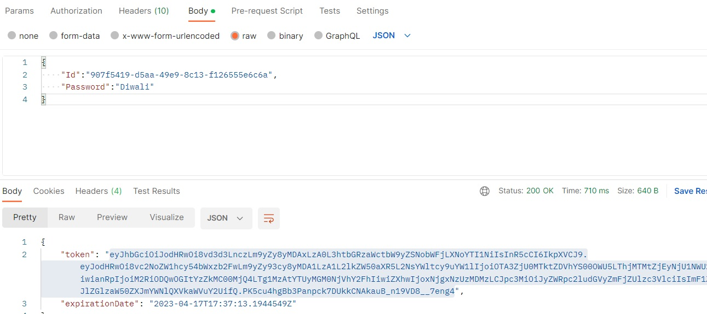
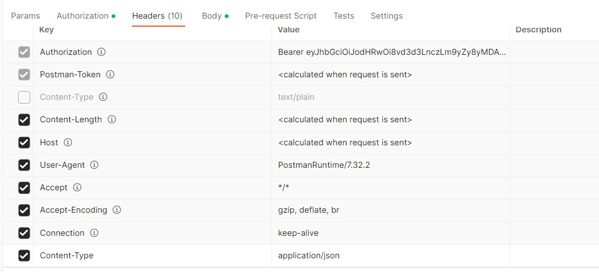

# Onboarding a new Cloud to the Middleware system:

For the middleware to plan optimal network application placement, it is important to import the network topology into the system. In this section, we will learn how to create a new Cloud entity in the Redis backend of the Middleware.

Adding a new entry in the Middleware topology allows Middleware to better optimize the resource and task planning to provide the best network capabilities to the Robot. Thanks to this, the Network Application placement can be adjusted to specific needs like low latency network thanks to the closer placement from the Robot or specific `network slice` requirement (upcoming!).

## Step 1 :  Authentication in Middleware

The user needs to be registered with the Middleware system. After Registeration, a token will be generated which will be used to create Robot, Onboarding Edge/Cloud, shown below; 



## Step 2 : Cloud Template

The full Cloud import template should look like this; 

```
{
  "Id": "638b99a5-9535-4053-a457-817f5e8ba1b3",
  "Name": "Cloud-1",
  "Type": "Cloud",
  "CloudStatus": "Running",
  "CloudIp": "192.168.1.4",
  "NumberOfCores": 30,
  "DiskStorage": 20,
  "VirtualRam": 0,
  "CPU": 1,
  "RAM": 2,
  "MacAddress": "2c549188c9e3",
  "LastUpdatedTime": "2023-04-17T13:50:30.0000000-07:00",
  "IsOnline": true,
  "Organization": "Beds"
}
```
The properties should contain the values as explained below:

* name - a unique name of the Edge within an Organization
* organization - the name of the group of middleware's cooperating together
* status - status of an Edge. One of `Active`, `Idle`, `Off`
* ipAddress - a public IP address on which the Middleware running on this Edge is accessible
* macAddress - mac address of a machine the Middleware is running on
* cpu - the number of the CPUs the machine has
* number of cores - the number of cores the machine consists of
* ram - the amount of memory the machine has at its disposal, expressed in GB
* virtual ram - the amount of virtual ram the machine has at its disposal, expressed in GB
* disk storage - the amount of storage available expressed in GB


## Step 3: Configuration of the preferred REST API client

As part of the configuration of the preferred REST API client like `Postman` or `Insomnia` the following properties have to be set.

* The IP address of the Middleware
* Path of a request `/data/cloud`
* Request method is set to `POST`
* `Content-Type` header value set to `application/json`


## Step 4 : Importing the Cloud definition

Before sending a POST request ensure that you have added the token obtained in [Step 1](#step-1-authentication-in-middleware).



After providing the correct token, execute the request. The Edge should be accepted and a new `ID` should be given by the Middleware.


## Closing

Onboarding of a new Cloud allows for the easy integration of the Middleware with other running instances.


