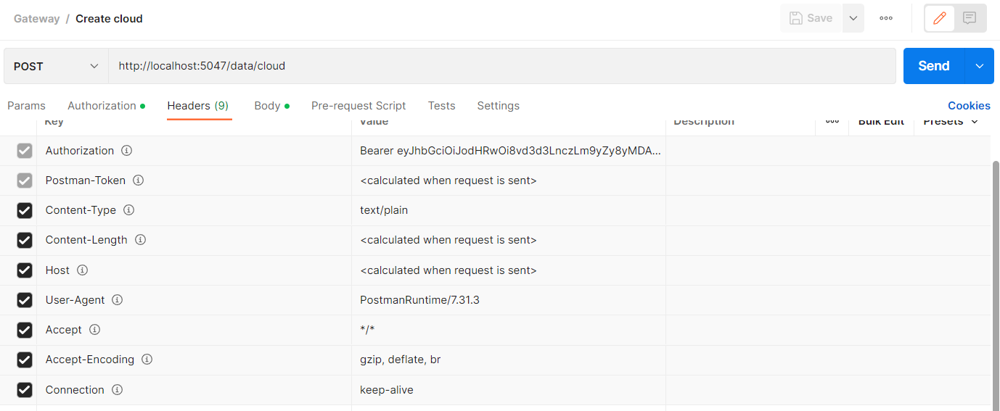

# 1) Onboard a new Cloud to the middleware system:

For the middleware to plan network applications placement, it is important to load the network topology inside the system. In this section, we will learn how to create a new Cloud entity in the Redis backend of the middleware.

A cloud template looks like this. All the fields must be completed. You may use automatically generated GUID for the id field. 
```
{
  "Id": "6fa85f64-5717-4562-b3fc-2c963f66afa6",
  "Name": "string",
  "Type": "string",
  "CloudStatus": "string",
  "CloudIp": "string",
  "NumberOfCores": 0,
  "DiskStorage": 0,
  "VirtualRam": 0,
  "CPU": 0,
  "RAM": 0,
  "MacAddress": "string",
  "LastUpdatedTime": "2009-06-15T13:45:30.0000000-07:00",
  "IsOnline": true
}
```

In the post request, remember to change the *localhost* to the location of your middleware. Also, the headers should look like this:

