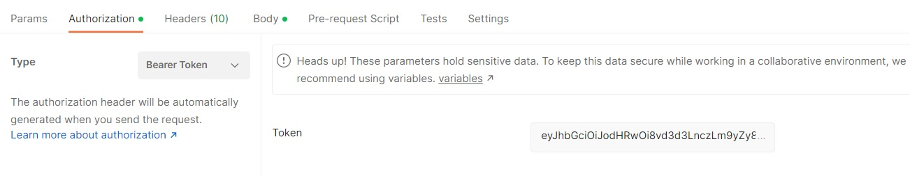

# 1) Onboarding a new Edge to the middleware system:

For the middleware to plan network applications placement, it is important to load the network topology inside the system. In this section, we will learn how to create a new Edge entity in the Redis backend of the middleware.

An Edge template looks like this. All the fields must be completed. You may use automatically generated GUID for the id field. 

## Step 1 :  
User needs to be registered with the Middleware system. After Registeration, a token will be generated which will be used to create Robot, Onboarding Edge/Cloud, shown below; 


 
## Step 2 : Edge Template

a. Run Guid Generator https://www.uuidgenerator.net/guid for the new Guid ID.

b. Complete all the fields including, 
Type should be always Edge for onboarding edge, 

Edge status should be (Unknown, Active, Idle, Off)

Edge Ip; if you running your system on windows 
                     ifconfig -->windows
                  
         if you running your system on linux ifconfig-->linux

The Edge template should look like this; 
```
{
  "Id": "44a85f64-5717-4562-b3fc-2c963f66afa6",
  "Name": "Edge-1",
  "Type": "Edge",
  "EdgeStatus": "Running",
  "EdgeIp": "192.168.1.4",
  "MacAddress": "2c549188c9e3",
  "CPU": 1,
  "RAM": 3,
  "VirtualRam": 0,
  "DiskStorage": 50,
  "NumberOfCores": 30,
  "LastUpdatedTime": "2009-06-15T13:45:30.0000000-07:00",
  "IsOnline": true,
  "Organization": "Beds"
}
```
Change your Organization accordingly; 


## Step 3 : 
Change the Local host to Ip address for the Postman.

In the post request, remember to change the *localhost* and port to the proper address location of your middleware. This is a POST request.
```
http://localhost:5047/data/edge
```
Also, the headers should look like this:

## Step 4 :

Add/Change the content-type to application/json and auth to bearer token as shown below; 




## Step 5: 

Change the name to Create Edge and send as shown in the image below; 


