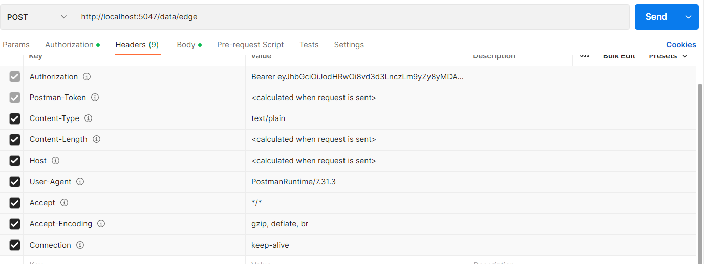

# 1) Onboard a new Edge to the middleware system:

For the middleware to plan network applications placement, it is important to load the network topology inside the system. In this section, we will learn how to create a new Edge entity in the Redis backend of the middleware.

An Edge template looks like this. All the fields must be completed. You may use automatically generated GUID for the id field. 
```
{
  "Id": "44a85f64-5717-4562-b3fc-2c963f66afa6",
  "Name": "string",
  "Type": "string",
  "EdgeStatus": "string",
  "EdgeIp": "string",
  "MacAddress": "string",
  "CPU": 1,
  "RAM": 3,
  "VirtualRam": 0,
  "DiskStorage": 0,
  "NumberOfCores": 0,
  "LastUpdatedTime": "2009-06-15T13:45:30.0000000-07:00",
  "IsOnline": true
}
```

In the post request, remember to change the *localhost* and port to the proper address location of your middleware. This is a POST request.
```
http://localhost:5047/data/edge
```
Also, the headers should look like this:

