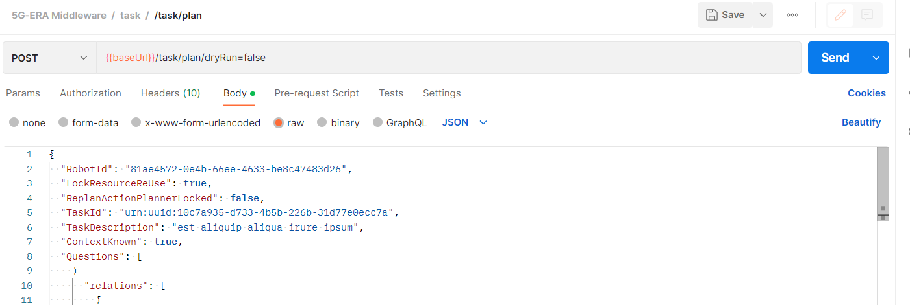

## Deployment of Network Application to the Middleware 

 In this section, we will learn how to deploy network application to the Middleware system. 

## Step 1:  Configuration of the preferred REST API Client

As part of the configuration of the preferred REST API client like `Postman` or `Insomnia` the following properties have to be set for the registration process

* The IP address of the Middleware
* Path of a request `task/plan/dryRun=false`
* Request method is set to `POST`
* `Content-Type` header value set to `application/json`


## Step 2: Network Application Template

The full NetApp template looks like this:

```
{
  "TaskId": "7d93728a-4a4c-4dae-8245-16b86f85b246",
  "RobotId": "ed7fbaf5-ac11-468c-9f12-7bf68d8a0a13",
  "LockResourceReUse": true,
  "ReplanActionPlannerLocked": true  
}
```


The template provided above, this endpoint will try to construct the full action sequence, assign resourcess needed, placement, and finally deploy the task. 


## Step 3: Use the token for accessing the Middleware

Once the user makes the request for the deployment, the response body will contain a token which will have to be attached to the calls in order to access the endpoints of the Middleware.


For attaching the token when making a call to one of the endpoints of the Middleware, the user has to do the following.
* Provide the path for to the endpoint
* Select the `Authorization` section
* Choose `Bearer Token` from the dropdown menu
* Paste the `token` in the token section and make the call by clicking `Send` button


