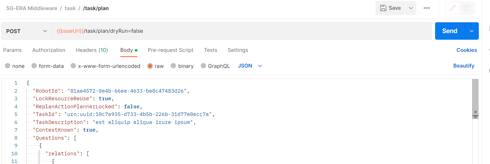

## Deployment of Network Application to the Middleware 

For the middleware to plan optimal network application placement, it is important to import the network topology into the system. In this section, we will learn how to deploy network application to the Middleware system. 

## Step 1:  Configuration of the preferred REST API Client

As part of the configuration of the preferred REST API client like `Postman` or `Insomnia` the following properties have to be set for the registration process

* The IP address of the Middleware
* Path of a request `task/plan/dryRun=false`
* Request method is set to `POST`
* `Content-Type` header value set to `application/json`


## Step 2: Network Application Template

The full NetApp template looks like this:

```
{
  "TaskId": "7d93728a-4a4c-4dae-8245-16b86f85b246",
  "RobotId": "ed7fbaf5-ac11-468c-9f12-7bf68d8a0a13",
  "LockResourceReUse": true,
  "ReplanActionPlannerLocked": true  
}
```


The template provided above, this endpoint will try to construct the full action sequence, assign resourcess needed, placement, and finally deploy the task. 


## Step 3: Use the token for accessing the Middleware

Once the user makes the request for the deployment, the response body will contain a token which will have to be attached to the calls in order to access the endpoints of the Middleware.


For attaching the token when making a call to one of the endpoints of the Middleware, the user has to do the following.
* Provide the path for to the endpoint
* Select the `Authorization` section
* Choose `Bearer Token` from the dropdown menu
* Paste the `token` in the token section and make the call by clicking `Send` button


