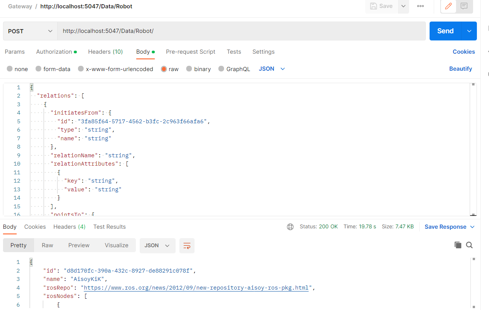

## Onboarding process of custom robot to the system:

Onboarding of a new robot requires an Onboarding file that may be avaialable for you already. If your robot is in this [list](available_robots/readme.md) you may use this template and just adjust it to the minor changes you may have. If your robot, however is not in the list, you will have to generate the onboarding template before. This template is a json that needs to be included in the body of the http request. [Download](/util/onboarding_robot.py) the script and run it in your robot to get the json file. 

____
Complete the template by taking into considerations the accepted values for each  of the fields:

*Note: Copy to the template as is. Capitals and lowercase matters.*

- **ROS Versions:** Foxy, Galactic, Melodic, Eloquent, Noetic,
        Lunar, Kinetic, Indigo, Hydro, Fuerte, Groovy,
        Electric, Humble, Crystal, Bouncy, Dashing, Ardent

- **Sensor types:** Laser, Ultrasonic, Infrared, Touch,
    Color, Temperature, Gyro, Imu, Camera, DepthCamera,
    Accelerometer, Gps, Encoder, Microphone, BatterySensor, Speaker, Display, Light

- **Robot Locomotion Types:** Walking,
        Rolling, Hopping, Slithering, Swimming, Brachiating, Flying, Hybrid, None

- **Robot Locomotion Systems:** Bipedal,
        Hexapodal, Quadripod, Tracked, Ackermann, Differential, None

- **Robot Actuator Types:** Prismatic,
        Rotatory.
  ___

Following, prepare your http request using postman or your prefered editor. The endpoint you will be calling is:

```
http://localhost:5047/Data/Robot
````

<p align="left">
  
</p>

You will have to add the content of the output script from the onboarding to the body of the script.

___
The headers required for this request should be the ones indicated in the image below.

<p align="left">
  
</p>

