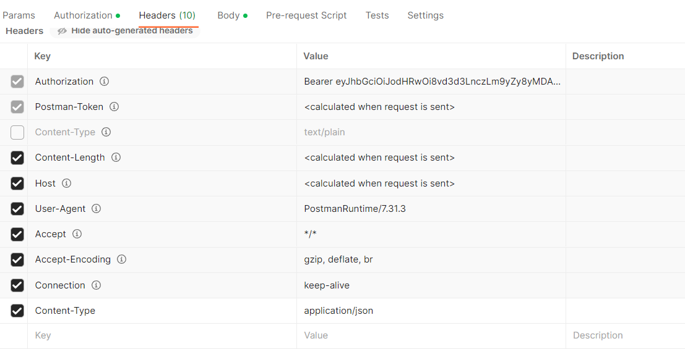

## Onboarding process of custom task to the Middleware system:

A task is a high level semantic representation of a real robot assignment. It consists of multiple actions that can run either in parallel or in sequence. In this section, we will learn how to create task with one action, and deploy Nginx. 

## Step 1: API Endpoint Call

It is assumed that both deployment.yaml and service.yaml k8 files are ready. After this, a python utility script (**flatten_yaml_to_json_string.py**) is used to translate both k8 files into a single line structure. This is needed for the API Endpoint call.

In the same directory where the python script is located, paste the two k8 yaml files. This will generate new files that will be used later on in the rest call, in the body section.

## Step 2: Add Task template

Make sure to have the openAPI specs with you so it will be easy to follow from here. Check the task add template, it should be similar to the example below. Here many items are created, an action, and instance and a ContainerImage. All together make the task representation. Unique identifiers (GUID) will be required for each of the Id fields. What is important also is that in the **ContainerImage section** both **K8SDeployment** and **K8SService** need to be completed with the output of the python utility script.

```
{
    "Id": "889fc9ac-f803-45ed-a6d4-8df33d4128a3",
    "Name": "Nginx web service for webinar",
    "TaskPriority": 1,
    "ActionSequence": [
        {
            "Id": "765c82db-7a63-45c6-9041-57634424dd23",
            "Name": "Nginx webinar",
            "Order": 1,
            "ActionPriority": "Normal",
            "ActionStatus": "None",
            "MinimumRam": 0,
            "MinimumNumCores": 0,
            "Services": [
                {
                    "Id": "e70c0e00-bda2-46a2-b338-f151c5a9731b",
                    "Name": "Nginx webinar",
                    "IsReusable": false,
                    "ContainerImage": {
                        "Id": "15889ea9-0909-4b47-8c1a-e6f7322291c9",
                        "Name": "Nginx webinar",
                        "Description": "The example network application onboarding for the webinar",
                        "K8SDeployment": "apiVersion: apps/v1\nkind: Deployment\nmetadata:\n  name: nginx-deployment\nspec:\n  selector:\n    matchLabels:\n      app: nginx\n  replicas: 2\n  template:\n    metadata:\n      labels:\n        app: nginx\n    spec:\n      containers:\n        - name: nginx\n          resources: {}\n          image: nginx\n          ports:\n            - containerPort: 80\n",
                        "K8SService": "apiVersion: v1\nkind: Service\nmetadata:\n  name: nginx-service\nspec:\n  selector:\n    app: nginx\n  ports:\n    - port: 80\n      targetPort: 80\n  type: LoadBalancer\n"
                    }
                }
            ]
        }
    ],
    "Tags": [
        "webinar",
        "5G-ERA",
        "Web"
    ]
}
```

Now lets look at the configuration requried from postman. Remember that all onboarding process can also be done from the 5G-ERA Dashboard. The endpoint to call is:

```
http://localhost:5047/data/task
```
Remember to change localhost and port to the proper address of your middleware. This is a POST request.


