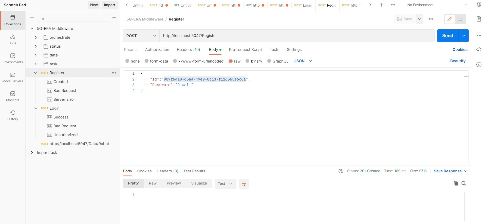
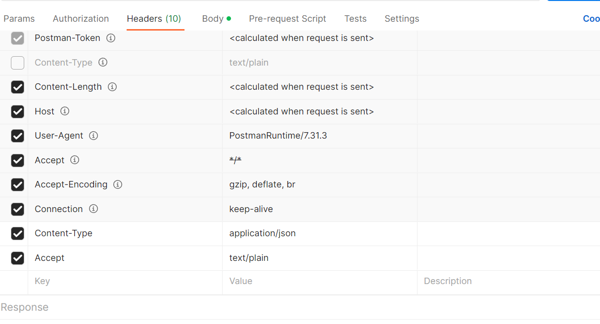
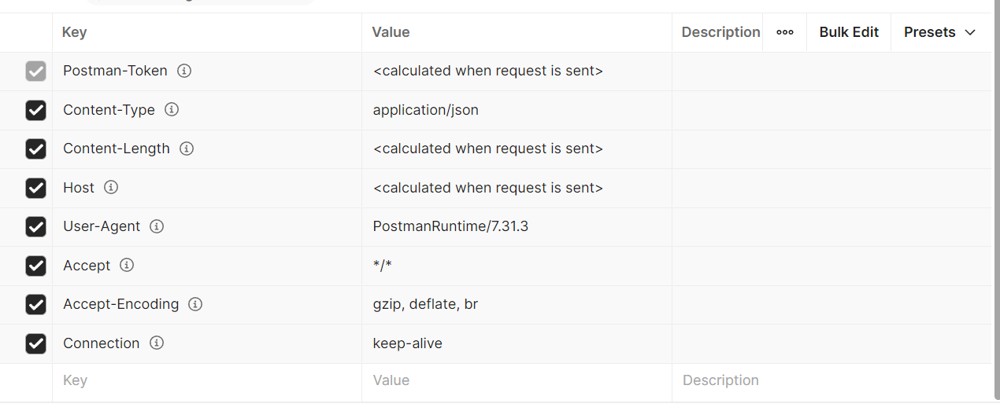

# 1) Onboard a new user to the middleware system:

## Register New User

To create a new user in the system use the following endpoint. You will be required to enter a randomly generated GUID and a password. Remember these ones for future log in. Change localhost to the IP of your middleware if you are not working in development enviroment under visual studio. And example of the request body:

```
{
    "Id": "ef7bd354-f891-4a24-8576-4fdc6143f941",
    "Password": "new_user"
}

```

The endpoint for registration:

**Remeber to change localhost to the IP of your middleware. Also this is a POST request.**

```
http://localhost:5047/Register
```



If there is any problem with running this endpoint, check the headers of the request. Hey should be as follows:



# 2) Login to the middleware system:

The endpoint for login:

```
http://localhost:5047/Login
```

You will need to use the information provided during  the registration in the body of the login request. Example:

```
{
    "Id": "ef7bd354-f891-4a24-8576-4fdc6143f941",
    "Password": "new_user"
}

```

**Remeber to change localhost to the IP of your middleware. Also this is a POST request.**

If there is any problem with running this endpoint, check the headers of the request. Hey should be as follows:

