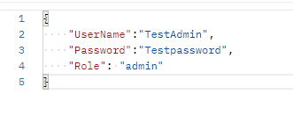

# 1) Onboard a new user to the Middleware system:

In this section, we will learn how to onboard a new user to the Middleware system. The steps are mentioned below:

## Step 1:  Authentication in Middleware

To create a new user in the Middleware system, the user needs to be registered with a username, password and role. After registering and logging in, a token will be generated will be used to authenticate the user changes in the Middleware 


## Step 2: User Template

The full User import template looks like the following: 

```
{
    "UserName": "TestAdmin",
    "Password": "Testpassword"
    "Role":"admin"
}
```


## Step 3: Configuration of the preferred REST API Client

As part of the configuration of the preferred REST API client like `Postman` or `Insomnia` the following properties have to be set.

* The IP address of the Middleware
* Path of a request `/data/user`
* Request method is set to `POST`
* `Content-Type` header value set to `application/json`

## Step 4: Importing the New User definition

Before sending a POST request ensure you have added the token obtained in Step 1. 


After providing the correct token, execute the request. The user should be accepted and a new ID should be given by the Middleware. 


