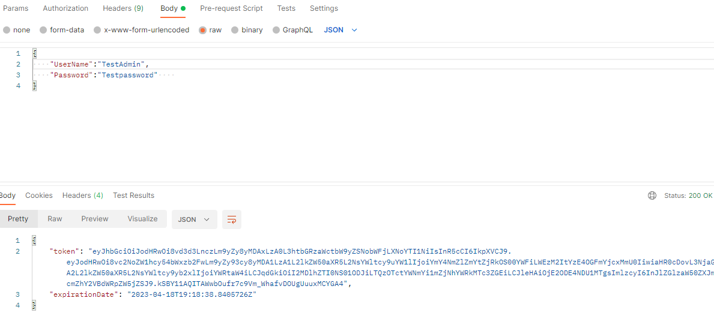

# 1) Onboard a new user to the middleware system:

## Step 1:  Register New User

To create a new user in the system, you will need username, password and role as shown in the picture below. Random GUID will be generated for further use. To confirm whether you have been registered or not, you will see status as 200 OK. 

## Step 2: Login New User

You will need the username and password to login, a token will be generated which you will further use to access the endpoints in the middleware shown below;

If there is any issue running the endpoints, please do check the headers of the request shown below; 

