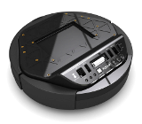

## Example of onboarding files for various robots.

At the moment, these are the available pre-defined onboarding files for robots that we have tested in the 5G-ERA project. We plan to extend this list in the future. Please, look at our roadmap for further details.

1) [Aisoy Kik](https://github.com/5G-ERA/middleware/blob/main/src/Common/Onboarding/RobotsExamples/AisoyKiK.json) - From Aisoy Robotics  

  

2) Kobuki Base - Yujin Robot
  
